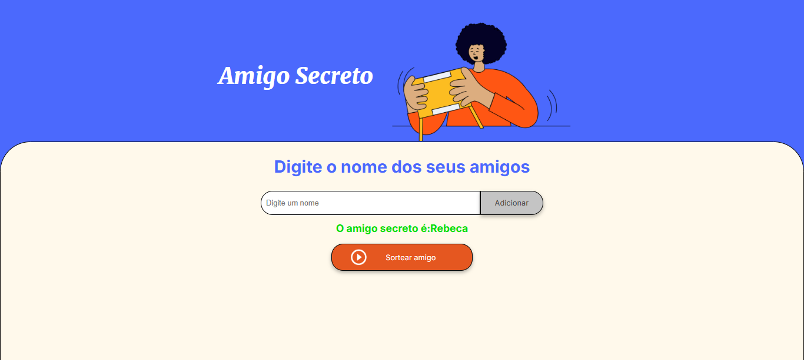

# Amigo Secreto

 Projeto desenvolvido como parte do programa **Oracle Next Education** em parceria com a **Alura**, com o objetivo de praticar e desenvolver habilidades em lógica de programação.

## Sobre o Projeto
"Amigo Secreto" é uma aplicação web simples que permite ao usuário adicionar nomes de amigos, sortear um amigo secreto de forma aleatória e exibir o resultado final. O projeto foi criado para por em prática conceitos fundamentais de lógica de programação e ajudar a aprender conceitos básicos, como variáveis, condicionais, funções, listas,etc.

## Funcionalidades
- **Adicionar nomes:** Insira nomes no campo de texto e clique em "Adicionar" para incluí-los na lista.
- **Sortear:** Com pelo menos 3 nomes, clique em "Sortear" para escolher um amigo secreto aleatoriamente.
- **Reiniciar:** Após o sorteio, clique novamente em "Sortear" para limpar a lista e começar de novo.
- **Resultado:** Exibe o resultado do sorteio (ex.: "O amigo secreto sorteado é: [nome]") e oculta a lista de nomes.

## Minha Contribuição
Eu desenvolvi toda a lógica do projeto em **JavaScript**, implementando as seguintes funcionalidades:
- Adição de nomes a uma lista usando arrays.
- Embaralhamento aleatório dos nomes com `sort` e `Math.random`.
- Exibição do resultado do sorteio e ocultação da lista de nomes com `style.display`.
- Funcionalidade de reiniciar o sorteio ao clicar novamente no botão "Sortear".

## Como Usar
1. Abra o arquivo `index.html` em um navegador (ex.: Chrome).
2. Digite pelo menos 3 nomes no campo e clique em "Adicionar" para cada nome.
3. Clique em "Sortear" para ver o resultado.
4. Para começar um novo sorteio, clique novamente em "Sortear" (isso limpa a lista e permite adicionar novos nomes).

## Possíveis Melhorias
Durante o desenvolvimento, identifiquei algumas melhorias que poderiam ser feitas:
- **Validação de nomes duplicados:** Impedir que o mesmo nome seja adicionado mais de uma vez.
- **Feedback visual:** Mostrar mensagens de confirmação (ex.: "Nome adicionado com sucesso!") para melhorar a experiência do usuário.

## Desafios Enfrentados
Como este foi meu primeiro projeto em JavaScript, enfrentei alguns desafios:
- **Embaralhamento aleatório:** Tive dificuldade inicial para embaralhar os nomes de forma aleatória, mas aprendi a usar `Math.random` e `sort`.
- **Manipulação do DOM:** Foi desafiador entender como ocultar e exibir elementos na página, mas tentei até conseguir com o uso de `style.display` e `innerHTML`.
- **Lógica de reinício:** Precisei pensar em uma forma de limpar os dados e reiniciar o sorteio sem adicionar novos botões, o que me ajudou a entender melhor o fluxo do programa.

## Capturas de Tela
### Tela Inicial

### Lista de Nomes

### Resultado do Sorteio

## Tecnologias Usadas
- **HTML:** Estrutura fornecida pelo programa Oracle Next Education e Alura.
- **CSS:** Estilização fornecida pelo programa Oracle Next Education e Alura.
- **JavaScript:** Lógica desenvolvida por mim.

## Créditos
Desenvolvido por **Ivany Correia** (lógica em JavaScript) como parte do desafio do programa **Oracle Next Education** em parceria com a **Alura**.